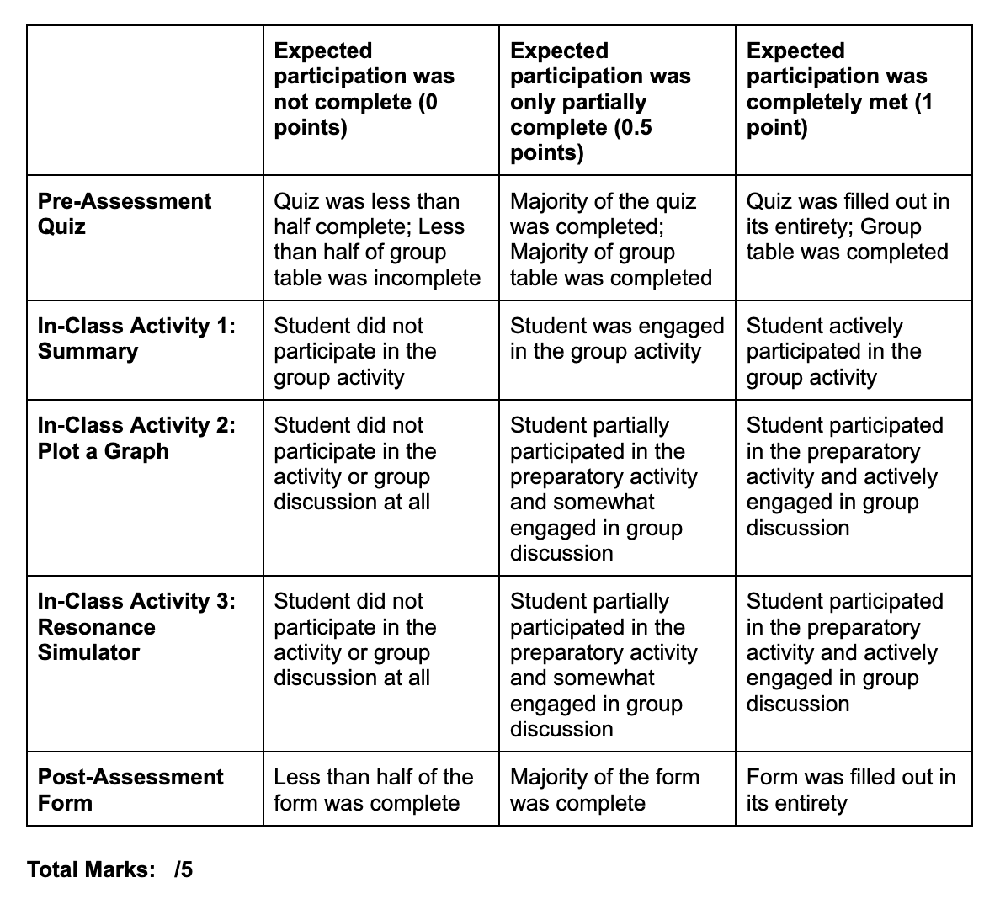

Welcome back ISCI 3A12!

We are excited to finish off our seminar series on planetary formation, which will be happening on **Monday, March 18th, 2024 at 2:30 pm (HH 305).** As a recap, we have discussed the following content: 

 [*Introductory Video*](https://www.macvideo.ca/media/LUE+Planets+Group+Introduction+Video/1_dyv3mf3x)
- RP1 content review: Kepler’s laws, exoplanets and their naming conventions
- Detection methods of exoplanets
- Categorisation of exoplanets
- Intro to planetary formation theory

[*Seminar 1*](https://samibabbar.github.io/luegroupplanets/)
- Progression and development of classical planetary formation theory
- Steps towards planetary formation (starting from dust growth)
- Formation of giant planets

With this information, we can now transition into **seminar 2**. Until now, we have covered the formation of exoplanets in the realm of growth from dust to planetary embryos. We also briefly discussed how this diverges off to the formation of different types of exoplanets. The focus of our last seminar will be discussing the formation of these different types and (continuing on from our focus on terrestrial, and gas/ice giants), important trends we see such as radius valleys, and an explanation of planetary migration and the formation of planetary systems. This will leave you, as budding astronomers or simply curious researchers, with some of the most relevant questions in exoplanet research!

For this pre-assessment, please make sure that you complete all the material below. This includes:
- Reviewing seminar 1 content and any questions that you may have
- Completing all pre-assessment material **DUE BY 12:30 pm on Monday, March 18th, 2024**
   - This includes the NetLogo simulation and pre-assessment quiz based on the mandatory videos

Additionally, you must be prepared to go into the seminar by:
- Bringing a writing utensil
- Coordinating the NetLogo pre-assessment with your LUE group and having prepared answers

Thank you for all your hard work thus far, and we are excited to continue our discussion on Monday!

> Ben, Keira, Max, Maya, Naya, Sami

## Transition: Seminar 1 to Seminar 2

You had questions, we answered! Using our survey, we compared the input you had at the beginning of the seminar with the feedback at the end. As a result, we have compiled the following document answering some of the most common questions to refresh your knowledge. If you were left with any confusion at the end of our last seminar, use this to cross-reference and get a better understanding of the content. You can also refer back to our pre-assessment page since it contains important review material, links back to our introduction video, and gives helpful readings/videos.

[Questions Answered from Last Seminar](https://drive.google.com/file/d/16IPJuHXSyT6f1avTw2jxth9uizn4ontr/view?usp=sharing)

Additionally, one of the main concepts we want to make sure you understand is the accretion of planetesimals into larger bodies, and giant planets. As such, **we have recorded two explanatory videos** to ensure that you retain this information. This is a **MANDATORY** part of our pre-seminar, and as such, we expect that you watch both videos. 

[Video 1: Pebble Accretion](https://drive.google.com/file/d/1GwvfK7t266neCJuLUy2Kvr96wk6vJUdW/view?usp=sharing)

[Video 2: Giant Planets](https://drive.google.com/file/d/1VHWoDg31966nFL3cYWT0iK7bSJ3kic7s/view?usp=sharing)
 
## Pre-Assessment Material
1. [Complete the following quiz pertaining to the introductory videos](https://forms.office.com/Pages/ResponsePage.aspx?id=B2M3RCm0rUKMJSjNSW9HchNo_KYDhA1NknGAniXeUkpUQVU0NE9WSkdJOUYzMUcySEExSjJRQTJKOS4u) - This is a short quiz with 4 questions, and will be assessed for completion and effort in responses.
2. NetLogo assignment (Assigned in your LUE groups): [See Instructions ](https://docs.google.com/document/d/1XqRkPwjGGxmHVyHn__IfLvSMjbhBIAESKese1f1SfDA/edit?usp=sharing)
4. Optional (But HIGHLY recommended): Review the exoplanet classifications within our [*introductory Video*](https://www.macvideo.ca/media/LUE+Planets+Group+Introduction+Video/1_dyv3mf3x) (From 7:38 to 11:51)

## Rubric for Seminar

